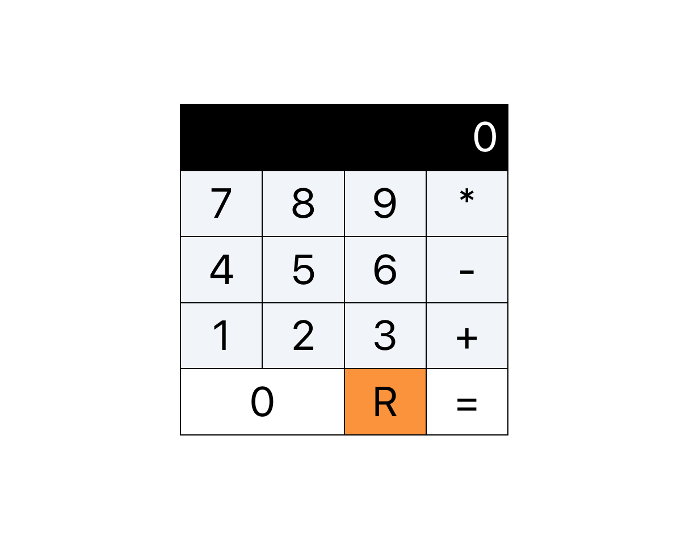
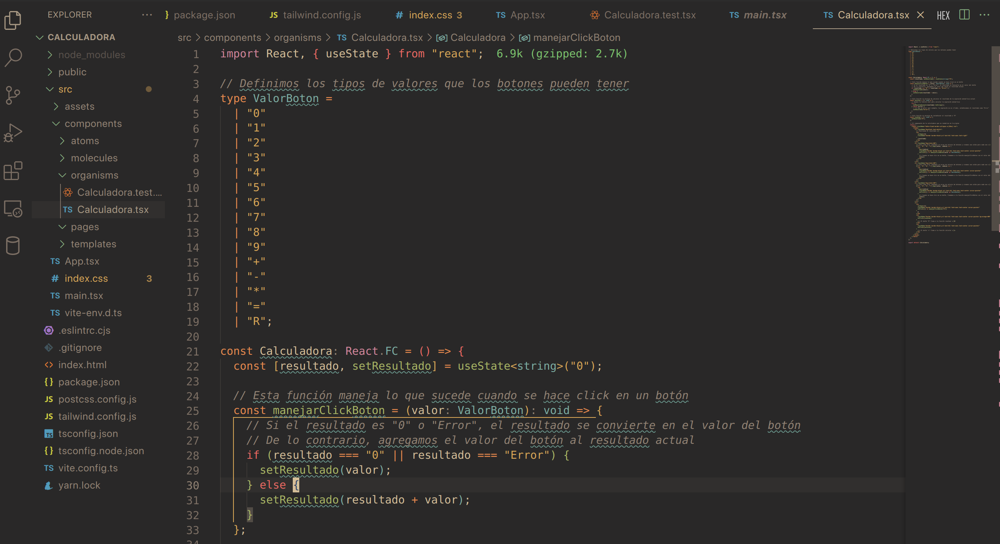
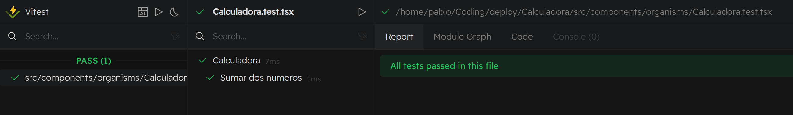

# Prueba de Calculadora

## Descripción
Este proyecto es una calculadora básica construida con React y Typescript. Permite realizar operaciones matemáticas y muestra los resultados al usuario. La lógica principal está contenida en el componente Calculadora, que gestiona el estado de la operación actual. La interfaz de usuario consta de una tabla que representa los botones de la calculadora. Para asegurar su correcto funcionamiento, el proyecto incluye pruebas con el framework Vitest. Es un ejemplo práctico del uso de React para crear aplicaciones interactivas con estado dinámico.

 

## Estructura de carpetas
El componente de calculadora se encuentra dentro de: componentes -> organismos -> Calculadora.tsx

 

## Instrucciones de Instalación
Para empezar con el proyecto Calculadora, sigue estos pasos:
1. Clona el repositorio:
```bash
git clone https://github.com/SundayLogic/Calculadora.git
```
2. Navega al directorio del proyecto:
```bash
cd Calculadora
```
3. Instala las dependencias necesarias:
```bash
npm install
```
o si usas yarn:
```bash
yarn install
```
## Uso/Ejemplos de código
Una vez completada la instalación, puedes ejecutar los siguientes comandos:

&middot; Para iniciar el servidor de desarrollo:
```bash
npm run dev
```
o
```bash
yarn dev
```
&middot; Para construir la aplicación:
```bash
npm run build
```
o
```bash
yarn build
```
&middot; Para iniciar la aplicación:
```bash
npm run start
```
o
```bash
yarn start
```
Para un uso más detallado y ejemplos de código, por favor consulta los directorios individuales de los componentes.

## Test de Prueba
Para ejecutar las pruebas del componente de la calculadora se abrirá una nueva pestaña donde se verán las pruebas implementadas

 

&middot; Ejecutar el entorno de desarrollo de pruebas:
```bash
npm test
```
or
```bash
yarn test
```
